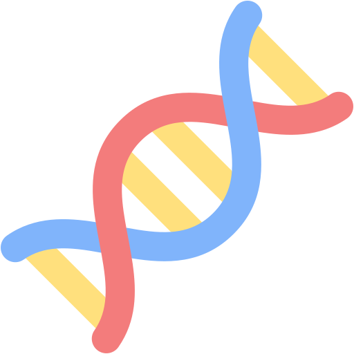

  

# <code style="color:fuchsia">Rheumatoïde artritis genexpressie getoond met transcriptomics</code>  
<code style="color:pink">Verslag transcriptomics - Annabel Kip J2P4</code>

# inhoud  
`figuren/`

# inleiding  
<code style="color:red">Reumatoïde artritis (RA)</code> is een chronische auto-immuunziekte waarbij <code style="color:fuchsia">ontstekingen</code> optreden in de gewrichten. Dit kan leiden tot <code style="color:red">weefselschade</code>, <code style="color:red">pijn</code> en uiteindelijk <code style="color:red">functieverlies</code>. Hoewel de klinische kenmerken van <code style="color:red">RA</code> goed bekend zijn, is de <code style="color:blue">moleculaire basis</code> van de ziekte slechts gedeeltelijk opgehelderd. Een benadering die helpt om deze mechanismen beter te begrijpen is <code style="color:fuchsia">transcriptomics</code>: de studie van <code style="color:fuchsia">genexpressie</code> op genoomschaal <code style="color:blue">(Woetzel et al., 2014)</code>. Door middel van technieken zoals <code style="color:green">RNA-sequencing</code> kunnen verschillen in <code style="color:fuchsia">genexpressie</code> tussen gezonde individuen en <code style="color:red">RA</code>-patiënten worden geïdentificeerd. Dit maakt het mogelijk om betrokken <code style="color:purple">signaalroutes</code>, <code style="color:purple">celtypes</code> en <code style="color:purple">biomarkers</code> in kaart te brengen.  

Binnen de transcriptomics wordt vaak gebruikgemaakt van analysetools zoals <code style="color:purple">KEGG-pathwayanalyse</code> en <code style="color:purple">Gene Ontology (GO)</code> om <code style="color:purple">biologische processen</code> en <code style="color:purple">signaalroutes</code> te duiden.  

In <code style="color:red">RA</code>-onderzoek helpt <code style="color:fuchsia">transcriptomics</code> onder andere bij het karakteriseren van <code style="color:purple">celpopulaties</code> en het identificeren van <code style="color:fuchsia">ontstekingsgerelateerde routes</code>. Met name <code style="color:red">cytokine</code>- en <code style="color:red">chemokine</code>-pathways, zoals <code style="color:red">TNF-α</code>, <code style="color:red">IL-6</code> en leden van de <code style="color:red">CCL</code>- en <code style="color:red">CXCL</code>-families, spelen een centrale rol in het ziekteproces. Deze moleculen vormen dan ook belangrijke targets voor therapieën.  
In dit onderzoek worden verschillen in <code style="color:fuchsia">genexpressie</code> inzichtelijk gemaakt met behulp van <code style="color:purple">KEGG-</code> en <code style="color:purple">GO-plots</code>, gegenereerd via meerdere <code style="color:blue">R-packages</code> binnen <code style="color:green">RStudio</code> (versie <code style="color:green">4.5.0</code>).

# Methode  
Voor dit onderzoek is gebruikgemaakt van <code style="color:green">RStudio</code> (versie <code style="color:green">4.5.0</code>) in combinatie met verschillende gespecialiseerde <code style="color:blue">R-packages</code>. De analyse richtte zich op <code style="color:green">RNA-sequencingdata</code> van vier patiënten met <code style="color:red">reumatoïde artritis (RA)</code> en vier gezonde controlepersonen (<code style="color:green">NORM</code>). Als referentie is het [humane genoom](data/Genoom) (<code style="color:blue">GRCh38.114</code>) gebruikt. Met de <code style="color:red">Rsubread</code>-package is een index van dit genoom opgebouwd en zijn de ruwe sequencebestanden gealigneerd, waarna <code style="color:mustard">Rsamtools</code> is toegepast voor de verwerking van de resulterende BAM-bestanden.  

Vervolgens is met <code style="color:blue">DESeq2</code> een countmatrix gegenereerd en zijn differentieel tot expressie gekomen genen geïdentificeerd. Hiervoor is eerst een <code style="color:blue">DESeqDataSet</code>-object aangemaakt om de gegevens te structureren en te normaliseren voor verdere analyse. Visualisatie van de resultaten gebeurde onder andere met <code style="color:fuchsia">EnhancedVolcano</code> (volcanoplot), <code style="color:magenta">ggplot2</code>, <code style="color:pink">ggrepel</code> (labels), en <code style="color:aqua">enrichplot</code> (verrijkingsvisualisatie).  

Voor functionele interpretatie van de genexpressieresultaten is <code style="color:purple">KEGG-pathwayanalyse</code> uitgevoerd via de <code style="color:orange">clusterProfiler</code>- en <code style="color:purple">KEGGREST</code>-packages. Twee belangrijke paden werden hierbij nader bekeken: <code style="color:purple">hsa04060</code> (cytokine-cytokinereceptorinteractie) en <code style="color:purple">hsa05323</code> (reumatoïde artritis). Deze pathways zijn visueel weergegeven met <code style="color:red">pathview</code>. Humane genannotatie werd verzorgd met <code style="color:bruh">org.Hs.eg.db</code> en <code style="color:green">AnnotationDbi</code>, terwijl <code style="color:aqua">readr</code> en <code style="color:green">dplyr</code> ondersteuning boden bij data-invoer en manipulatie.  

Deze workflow biedt inzicht in <code style="color:red">RA</code>-gerelateerde <code style="color:fuchsia">genexpressiepatronen</code> en relevante <code style="color:purple">biologische routes</code>.

# Resultaten  

## Vulcano plot  
Met de [volcanoplot](figuren/Rplot01metcutoff.jpeg) wordt op de x-as de <code style="color:fuchsia">log2-fold change</code> van genexpressie tussen twee condities gemeten. Dit geeft aan hoe <code style="color:red">sterk</code> een gen <em>verhoogd</em> of <em>verlaagd</em> wordt.  
De y-as toont de <code style="color:red">-log10 p-waarde</code>, deze geeft aan hoe <code style="color:red">statistisch significant</code> de verandering is.  
De plot helpt om genen te identificeren die het meest relevant zijn voor het verschil tussen <code style="color:red">RA</code>-patiënten en gezonde controles.  
Een interessant gen is <code style="color:fuchsia">SRGN</code> die aan de positieve kant van de log2-fold change hoog staat aan de -log10p-as.

## Barplot  
De barplot leest makkelijk af welke <code style="color:purple">pathway</code> het meeste voorkomt.  
[barplot](figuren/barplot GO BP.jpeg)
<code style="color:fuchsia">Lymphocyte differentiation</code> heeft de hoogste count.  
Een verhoging van lymfocyten differentiatie is typisch bij auto-immuunziekten zoals <code style="color:red">RA</code>. Lymfocyten differentiatie wordt gereguleerd door onder anderen <code style="color:red">cytokines</code>, die een belangrijke rol spelen in het immuunsysteem en ontstekingsreacties.

## KEGG pathway  
Van [hsa05323](figuren/hsa05323.RA_demo.png) is een KEGG pathway gemaakt  
<code style="color:red">IL6</code> is roodgekleurd, wat wil zeggen dat deze meer voorkomt bij mensen met <code style="color:red">RA</code>. IL6 heeft volgens de KEGG pathway een gevolg naar <code style="color:red">inflammatie</code> en <code style="color:red">synovial pannus formatie</code>. Naast <code style="color:red">IL6</code> zijn <code style="color:red">GM-CSF</code>, <code style="color:red">IL1beta</code> en <code style="color:red">CCL5</code> ook verhoogd. Dit is een kenmerkend <code style="color:red">cytokineprofiel</code> voor mensen met <code style="color:red">RA</code>, en deze moleculen dragen bij aan de pathologie en symptomen van de ziekte.

Van [hsa04060](figuren/hsa04060.pathview.png) is een KEGG pathway gemaakt  
Deze afbeelding geeft een volledig beeld van alle <code style="color:red">cytokine-cytokine reacties</code> die betrokken zijn bij de betreffende data die verkregen is. Deze interacties zijn cruciaal voor het begrijpen van de immuunrespons en het inflammatoire proces bij <code style="color:red">RA</code>.

# Conclusie  
Deze transcriptomics-analyse heeft aangetoond dat er duidelijke verschillen zijn in <code style="color:fuchsia">genexpressie</code> tussen patiënten met <code style="color:red">reumatoïde artritis (RA)</code> en gezonde controlepersonen. Met behulp van <code style="color:green">RNA-sequencing</code> en <code style="color:blue">DESeq2</code>-analyse zijn meerdere genen geïdentificeerd die significant tot expressie komen bij <code style="color:red">RA</code>, waarvan een opvallend aandeel betrokken is bij <code style="color:red">ontstekingsregulatie</code>.  

In het bijzonder kwam <code style="color:red">interleukine-6 (IL-6)</code> naar voren als een sterk verhoogd tot expressie komend gen. IL-6 speelt een cruciale rol in de <code style="color:red">ontstekingscascade</code> en is nauw verbonden met ziekteactiviteit bij <code style="color:red">RA</code>. Dit werd verder ondersteund door de <code style="color:purple">KEGG-pathwayanalyse</code>, waarin IL-6 centraal stond in zowel de <code style="color:purple">cytokine-cytokinereceptorinteractie</code> (<code style="color:purple">hsa04060</code>) als de <code style="color:red">RA-specifieke pathway</code> (<code style="color:purple">hsa05323</code>). De verhoogde IL-6-expressie bevestigt de centrale positie van deze <code style="color:red">cytokine</code> in <code style="color:red">RA-pathogenese</code> en benadrukt het belang van gerichte therapieën, zoals <code style="color:red">IL-6-remmers</code>.  

Door gebruik te maken van een combinatie van bioinformatica-tools in <code style="color:green">RStudio</code> is niet alleen IL-6, maar ook een breder netwerk van betrokken genen en signaalroutes in kaart gebracht, zoals <code style="color:red">GM-CSF</code>, <code style="color:red">IL1-beta</code> en <code style="color:red">CCL5</code>. Dit is een kenmerkend <code style="color:red">cytokineprofiel</code> voor mensen met <code style="color:red">RA</code>. Deze studie bevestigt het potentieel van <code style="color:green">RNA-seq</code>-gebaseerde genexpressieanalyse om sleutelspelers zoals IL-6 te identificeren, wat bijdraagt aan een beter moleculair inzicht in <code style="color:red">RA</code> en mogelijke aangrijpingspunten voor behandeling.
